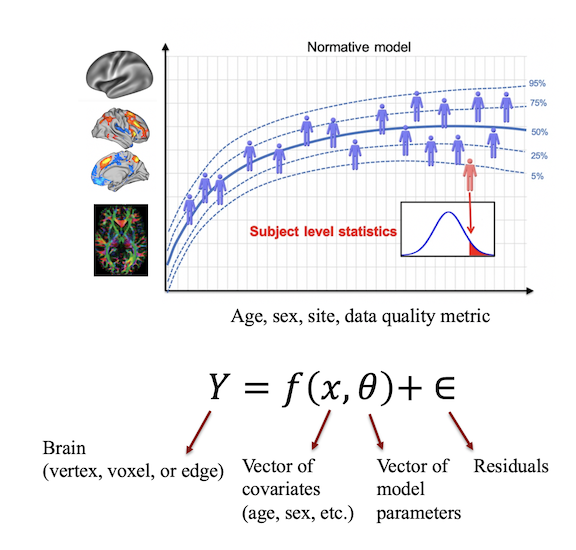

# Normative modeling demo with PCNtoolkit

This repository contains tutorials on normative modeling using the [PCNtoolkit](https://pcntoolkit.readthedocs.io/en/latest/). 

Please adhere to the citation guidelines availabe in each tutorial directory.

`tutorials/` --> Contains the Python notebooks for all tutorials. Each tutorial is in a sub-directory within this folder. 

* [CPC_2020](https://github.com/predictive-clinical-neuroscience/PCNtoolkit-demo/tree/main/tutorials/CPC_2020): Computational Psychiatry Course 2020 tutorial using Gaussian Process Regression (GPR)
* [CPC_2021](https://github.com/saigerutherford/CPC_ML_tutorial): Computational Psychiatry Course 2021 tutorial using Bayesian Linear Regression (BLR)
* [BLR_protocol](https://github.com/predictive-clinical-neuroscience/PCNtoolkit-demo/tree/main/tutorials/BLR_protocol): The Normative Modeling Framework for Computational Psychiatry. Rutherford et al. 2021. Accepted at Nature Protocols. Preprint available via [BioRxiv](https://www.biorxiv.org/content/10.1101/2021.08.08.455583v1).
* [HBR_FCON](https://github.com/predictive-clinical-neuroscience/PCNtoolkit-demo/tree/main/tutorials/HBR_FCON): A tutorial on Hierarchical Bayesian Linear Regression using FCON data (many sites).
* For a tutorial on GAMLSS see this [repository](https://github.com/dinga92/gamlss_normative_paper) and [preprint](https://www.biorxiv.org/content/10.1101/2021.06.14.448106v1.abstract). 

`data/` --> Contains the data used in the tutorials. Data created during the tutorial will be output into this folder. 

It is recommended to run the tutorial via Google Colab python notebooks. These are essentially Jupyter notebooks run in the *cloud*. Running the code using Colab will save us from dealing with python library installation and virtual environment setup. 

You can also locally clone this repository to your computer, however you are responsible for setting up your own python environment and installing the dependencies. Read more on how to do this and check the latest updates and dependencies on the PCNtoolkit's GitHub [repository](https://github.com/amarquand/PCNtoolkit). Please note that some of the tutorials require different versions of the PCNtoolkit. You should always verify which version the tutorial requires before setting up your virtual environment.  

For additional helpful tips on setting up Google colab and using keyboard shortcuts, also see the ReadMe file for the [CPC course](https://github.com/saigerutherford/CPC_ML_tutorial/blob/master/README.md).

Each tutorial directory contains its' own ReadMe file containing specific instructions. When you are ready to run the analysis, you can launch the tutorial notebook by clicking the 'Open in Colab' button found in the tutorial's ReadMe file. You need to be signed in to a Google account in your internet browser and for best results, use Chrome web browser. 
